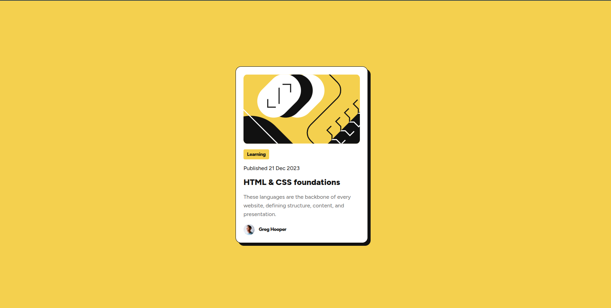

# Frontend Mentor - Blog preview card solution

This is a solution to the [Blog preview card challenge on Frontend Mentor](https://www.frontendmentor.io/challenges/blog-preview-card-ckPaj01IcS). Frontend Mentor challenges help you improve your coding skills by building realistic projects. 

## Table of contents

- [Overview](#overview)
  - [The challenge](#the-challenge)
  - [Screenshot](#screenshot)
  - [Links](#links)
  - [Built with](#built-with)
  - [What I learned](#what-i-learned)
  - [Continued development](#continued-development)
- [Author](#author)
- [Acknowledgments](#acknowledgments)


## Overview

This design feature a blog preview card.

### The challenge

Users should be able to:

- See hover and focus states for all interactive elements on the page

### Screenshot



### Links

- Solution URL: (https://github.com/IGNORAMUS1/blog-preview-card.git)
- Live Site URL: (https://ignoramus1.github.io/blog-preview-card/)


### Built with

- Semantic HTML5 markup
- CSS custom properties
- Flexbox


### What I learned

This design challenge has improve my knowledge in CSS - using flex to organise element in container and set box shadow.

```css
.attribution {
    display: flex;
    flex-direction: column;
    gap: 16px;
    box-shadow: 8px 8px hsl(0, 0%, 7%);
}
```

### Continued development

I want to keep learning the core part of HTML and CSS. Although, I'm already learning React, a frontend library, but I feel like knowing the core aspect of CSS and HTML because the are the foundation when it comes to web development if not software development.

## Author

- Website - [Folorunsho Opeyemi]
- Frontend Mentor - [@IGNORAMUS1](https://www.frontendmentor.io/profile/IGNORAMUS1)

## Acknowledgments

I want to use this medium to appreciate for make this challenge available to everyone dreaming to be a frontend developer and the maker of this design. 
